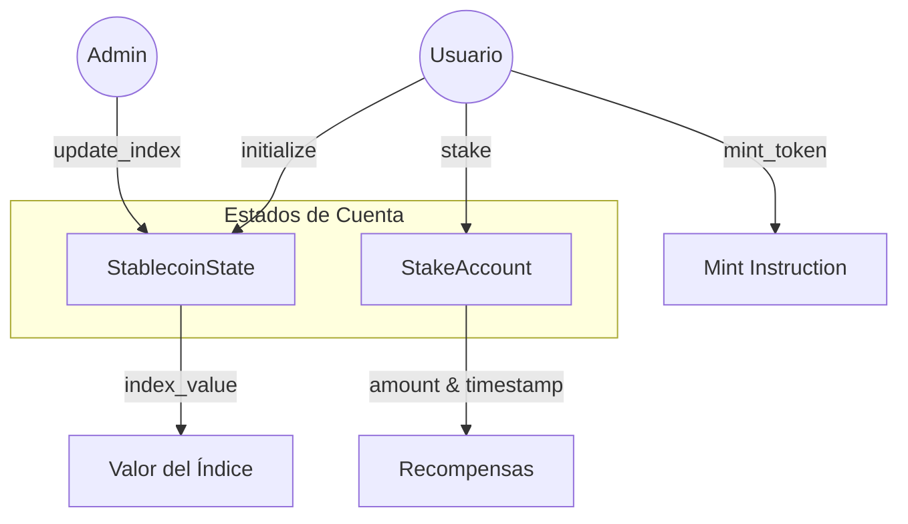

<div align="center">
# 🧉 Yerba Security Token

[](https://solana.com/)
[](https://www.anchor-lang.com/)
[](https://www.rust-lang.org/)
[](https://opensource.org/licenses/MIT)

**Yerba Stablecoin** es un protocolo de moneda estable descentralizado construido sobre la blockchain de **Solana** utilizando el framework **Anchor**. Ofrece una infraestructura robusta para la gestión de activos digitales, staking y actualizaciones de índices de valor en tiempo real.

[Explorar Código](file:///c:/Users/kathe/OneDrive/Desktop/yerba_stablecoin/programs/yerba_stablecoin/src) • [Reportar Error](https://github.com/tu-usuario/yerba-stablecoin/issues) • [Wiki](https://github.com/tu-usuario/yerba-stablecoin/wiki)

</div>

---

## 🏗️ Arquitectura del Sistema

El programa gestiona el estado global de la stablecoin y las cuentas individuales de los usuarios para el staking.



### Componentes Principales

- **`StablecoinState`**: Almacena la configuración global, incluyendo el administrador actual, el valor del índice y el suministro total.
- **`StakeAccount`**: Cuenta individual de cada usuario que rastrea la cantidad depositada y el tiempo de inicio para el cálculo de incentivos.

---

## 🛠️ Instrucciones del Programa

El smart contract se divide en módulos de instrucciones claras y eficientes:

### 1. `initialize`
Configura el estado inicial del programa.
- **Acceso**: Cualquiera (el firmante se convierte en `admin`).
- **Estado**: Inicializa `index_value` y `total_supply` en 0.

### 2. `update_index`
Permite al administrador actualizar el valor de referencia de la stablecoin.
- **Acceso**: Solo `admin`.
- **Propósito**: Sincronizar el valor del protocolo con oráculos o índices externos.

### 3. `mint_token`
Mecanismo para la emisión de nuevos tokens.
- **Acceso**: Firmado por el usuario.
- **Lógica**: Incrementa el `total_supply` en el estado global.

### 4. `stake`
Permite a los usuarios bloquear sus activos para participar en el protocolo.
- **Acceso**: Firmado por el usuario.
- **Datos**: Registra el `owner`, el `amount` y el `start_time` (Unix Timestamp).

---

## 🚀 Guía de Inicio Rápido

### Requisitos Previos
- [Rust](https://www.rust-lang.org/tools/install)
- [Solana CLI](https://docs.solana.com/cli/install-solana-cli-tools)
- [Anchor Framework](https://www.anchor-lang.com/docs/installation)

### Instalación
1. Clonar el repositorio:
   ```bash
   git clone https://github.com/tu-usuario/yerba-stablecoin.git
   cd yerba-stablecoin
   ```

2. Instalar dependencias:
   ```bash
   yarn install
   ```

3. Compilar el programa:
   ```bash
   anchor build
   ```

4. Ejecutar tests:
   ```bash
   anchor test
   ```

---

## 📁 Estructura del Proyecto

```text
programs/yerba_stablecoin/src/
├── instructions/       # Lógica detallada por comando
│   ├── initialize.rs   # Setup inicial
│   ├── mint.rs         # Minteo de tokens
│   ├── stake.rs        # Gestión de staking
│   └── update_index.rs # Actualización de parámetros
├── constants.rs        # Semillas y valores constantes
├── error.rs            # Códigos de error personalizados
├── lib.rs              # Punto de entrada del programa
├── state.rs            # Definición de estructuras de datos
└── instructions.rs     # Re-exportación de módulos
```

---

## 🛡️ Seguridad y Consideraciones
- **Control de Acceso**: La función `update_index` está protegida por `has_one = admin`.
- **Manejo de Errores**: Implementa códigos de error personalizados para una mejor trazabilidad en la red.
- **Aritmética Segura**: Uso de `checked_add` para prevenir overflows.

---

<div align="center">
Desarrollado con ❤️ para el ecosistema Solana.
</div>
